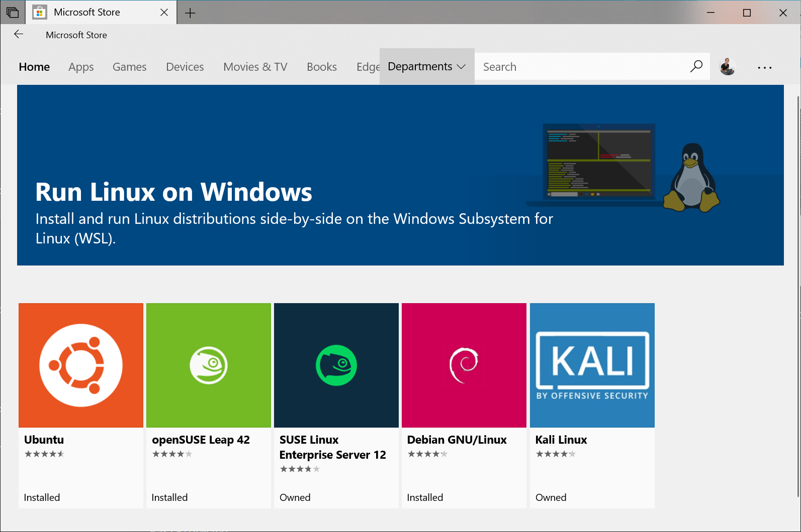

# 在WSL2上部署标准k8s集群并使用Prometheus监控spring cloud服务

> 2019年Windows Build大会上，微软发布 `WSL2`，意味着开发者们终于可以在Windows上开发和运行原汁原味 `Linux` 应用。

本篇文章将教会大家如何在 `WSL2` 部署一个标准版的 `k8s` 集群以及使用 `Prometheus` 和 `grafana` 监控 `spring cloud` 服务。

和第一代 `WSL`不同，`WSL2` 是运行在 `hyper-v` 上的一个 `VM`，因此可以运行原汁原味的 `Linux` 发行版，例如 `Ubuntu`，同样对 `Linux ABI` 接口兼容也更好，支持更多 `Linux` 应用，例如 `docker` 。

经过将近一年时间的开发与优化，微软团队终于发布了正式版 `WSL2`，用户只需将操作系统升级到 `2004` 以后的 `Windows 10` 即可。

## 准备工作

### 安装 `WSL`

前置条件：

* 操作系统必须是 `Windows 10 build 2004` 以后的版本
* `C盘` 剩余空间最好在 `64G` 以上
* 内存最好是 `16G` 以上，`8g` 内存运行 `k8s` 集群后，就没有剩余内存

安装开始：

1. 在桌面左下角 `Windows` 徽标上，右键选择 `Windows Powershell(管理员)(A)`，然后运行一下脚本

```powershell
dism.exe /online /enable-feature /featurename:Microsoft-Windows-Subsystem-Linux /all /norestart
```
> 如果这里遇到失败，多半是操作系统没有升到最新版本的 `Windows 10` 或者 

2. 安装 WSL 2 之前，必须启用“虚拟机平台”可选功能。

```powershell
dism.exe /online /enable-feature /featurename:VirtualMachinePlatform /all /norestart
```

3. 重新启动计算机，以完成 WSL 安装并更新到 WSL 2。

4. 将 WSL 2 设置为默认版本

安装新的 Linux 分发版时，请在 Powershell 中运行以下命令，以将 WSL 2 设置为默认版本：

```powershell
wsl --set-default-version 2
```

5. 安装所选的 Linux 分发版

打开 [Microsoft Store](https://aka.ms/wslstore)，并选择你偏好的 Linux 分发版。



单击以下链接会打开每个分发版的 Microsoft Store 页面：

* [Ubuntu 16.04 LTS](https://www.microsoft.com/store/apps/9pjn388hp8c9)
* [Ubuntu 18.04 LTS](https://www.microsoft.com/store/apps/9N9TNGVNDL3Q)
* [Ubuntu 20.04 LTS](https://www.microsoft.com/store/apps/9n6svws3rx71)
* [openSUSE Leap 15.1](https://www.microsoft.com/store/apps/9NJFZK00FGKV)
* [SUSE Linux Enterprise Server 12 SP5](https://www.microsoft.com/store/apps/9MZ3D1TRP8T1)
* [SUSE Linux Enterprise Server 15 SP1](https://www.microsoft.com/store/apps/9PN498VPMF3Z)
* [Kali Linux](https://www.microsoft.com/store/apps/9PKR34TNCV07)
* [Debian GNU/Linux](https://www.microsoft.com/store/apps/9MSVKQC78PK6)
* [Fedora Remix for WSL](https://www.microsoft.com/store/apps/9n6gdm4k2hnc)
* [Pengwin](https://www.microsoft.com/store/apps/9NV1GV1PXZ6P)
* [Pengwin Enterprise](https://www.microsoft.com/store/apps/9N8LP0X93VCP)
* [Alpine WSL](https://www.microsoft.com/store/apps/9p804crf0395)

 6. 在分发版的页面中，选择“获取”。

 

 7. 设置新分发版

首次启动新安装的 Linux 分发版时，将打开一个控制台窗口，系统会要求你等待一分钟或两分钟，以便文件解压缩并存储到电脑上。 未来的所有启动时间应不到一秒。

然后，需要[为新的 Linux 分发版创建用户帐户和密码](https://docs.microsoft.com/zh-cn/windows/wsl/user-support)。

 

将分发版版本设置为 WSL 1 或 WSL 2
可以打开 PowerShell 命令行并输入以下命令（仅在 [Windows 内部版本 19041 或更高版本](ms-settings:windowsupdate)中可用），来检查分配给每个已安装的 Linux 分发版的 WSL 版本：`wsl -l -v`

```powershell
wsl --list --verbose
```

若要将分发版设置为受某一 WSL 版本支持，请运行：

```powershell
wsl --set-version <distribution name> <versionNumber>
```

请确保将 `<distribution name>` 替换为你的分发版的实际名称，并将 `<versionNumber>` 替换为数字“1”或“2”。 可以随时更改回 `WSL 1`，方法是运行与上面相同的命令，但将“2”替换为“1”。
此外，如果要使 `WSL 2` 成为你的默认体系结构，可以通过此命令执行该操作：

```powershell
wsl --set-default-version 2
```

这会将安装的任何新分发版的版本设置为 `WSL 2`。

 8. 排查安装问题

下面是相关的错误和建议的修复措施。 有关其他常见错误及其解决方法，请参阅 [WSL 故障排除页](https://docs.microsoft.com/zh-cn/windows/wsl/troubleshooting)。

* 安装失败并出现错误 0x80070003
    * 适用于 Linux 的 Windows 子系统只能在系统驱动器（通常是 C: 驱动器）中运行。 请确保分发版存储在系统驱动器上：
    * 打开“设置”->“存储”->“更多存储设置： 更改新内容的保存位置”
* WslRegisterDistribution 失败并出现错误 `0x8007019e`
    * 未启用“适用于 Linux 的 Windows 子系统”可选组件：
    * 打开“控制面板” -> “程序和功能” -> “打开或关闭 Windows 功能”-> 选中“适用于 Linux 的 Windows 子系统”，或使用本文开头所述的 PowerShell cmdlet。
* 安装失败，出现错误 `0x80070003` 或错误 `0x80370102`
    * 请确保在计算机的 BIOS 内已启用虚拟化。 有关如何执行此操作的说明因计算机而异，并且很可能在 CPU 相关选项下。
* 尝试升级时出错：`Invalid command line option: wsl --set-version Ubuntu 2`
    * 请确保已启用适用于 Linux 的 Windows 子系统，并且你使用的是 Windows 内部版本 19041 或更高版本。 若要启用 WSL，请在 Powershell 提示符下以具有管理员权限的身份运行此命令：`Enable-WindowsOptionalFeature -Online -FeatureName Microsoft-Windows-Subsystem-Linux`。 可在[此处](https://docs.microsoft.com/zh-cn/windows/wsl/install-win10)找到完整的 WSL 安装说明。
* 由于虚拟磁盘系统的某个限制，无法完成所请求的操作。虚拟硬盘文件必须是解压缩的且未加密的，并且不能是稀疏的。
    * 请检查 [WSL Github](https://github.com/microsoft/WSL/issues/4103) 主题 #4103，其中跟踪了此问题以提供更新的信息。
* 无法将词语“wsl”识别为 cmdlet、函数、脚本文件或可运行程序的名称。
    * 请确保已安装“适用于 Linux 的 Windows 子系统”可选组件。 此外，如果你使用的是 Arm64 设备，并从 PowerShell 运行此命令，则会收到此错误。 请改为从 PowerShell Core 或从命令提示符运行 wsl.exe。

 9. 额外工作

* 禁用 `swap`

    因为 `kubelet` 不支持 `swap` 内存，因此需要通过设置 `wslconfig` 禁用 `swap` 。在 `用户根目录` 创建 `.wslconfig` 文件，例如： 'C:\Users\huang' ，添加以下内容：

    ```toml
    [wsl2]
    swap=0 # 关闭swap

    [network]
    generateResolvConf = false # 解决域名解析失败的问题
    ```

    然后在 `powershell` 或 `cmd` 运行以下命令，关闭 `wsl`，再点击开始菜单 `Ubuntu` 图标，即完成重启 `WSL`。

    ```powershell
    wsl --shutdown
    ```

* 设置 `/etc/resolve.conf`

    因为每次 `WSL` 启动会自动覆盖 `/etc/resolve.conf` 文件，可能会导致域名解析失败的问题，必要时可以设置自定义的 `DNS服务器` ，把以下内容追加到 `/etc/resolve.conf` 文件末尾：(需要 `root` 权限，记得加上 `sudo`)

    ```conf
    nameserver 8.8.8.8
    nameserver 114.114.114.114
    ```

* 替换 `apt` 源

    `Ubuntu` 官方源在国内并不好用，因此我们需要替换源，提高软件安装和更新速度。编辑 `/etc/apt/sources.list`，为了安全可以先备份以下原文件

    ```sh
    # 备份source.list文件
    sudo mv /etc/apt/sources.list /etc/apt/sources.list.bak
    # 创建source.list文件
    sudo vim /etc/apt/sources.list
    ```

    按 `i` 进入编辑模式，然后把以下内容复制粘贴到 `/etc/apt/sources.list` 文件

    > 这是清华大学 `Ubuntu 18.04 LTS` 的镜像源，可根据用户安装的发行版自行替换

    ```toml
    # 默认注释了源码镜像以提高 apt update 速度，如有需要可自行取消注释
    deb https://mirrors.tuna.tsinghua.edu.cn/ubuntu/ bionic main restricted universe multiverse
    # deb-src https://mirrors.tuna.tsinghua.edu.cn/ubuntu/ bionic main restricted universe multiverse
    deb https://mirrors.tuna.tsinghua.edu.cn/ubuntu/ bionic-updates main restricted universe multiverse
    # deb-src https://mirrors.tuna.tsinghua.edu.cn/ubuntu/ bionic-updates main restricted universe multiverse
    deb https://mirrors.tuna.tsinghua.edu.cn/ubuntu/ bionic-backports main restricted universe multiverse
    # deb-src https://mirrors.tuna.tsinghua.edu.cn/ubuntu/ bionic-backports main restricted universe multiverse
    deb https://mirrors.tuna.tsinghua.edu.cn/ubuntu/ bionic-security main restricted universe multiverse
    # deb-src https://mirrors.tuna.tsinghua.edu.cn/ubuntu/ bionic-security main restricted universe multiverse

    # 预发布软件源，不建议启用
    # deb https://mirrors.tuna.tsinghua.edu.cn/ubuntu/ bionic-proposed main restricted universe multiverse
    # deb-src https://mirrors.tuna.tsinghua.edu.cn/ubuntu/ bionic-proposed main restricted universe multiverse
    deb [arch=amd64] https://download.docker.com/linux/ubuntu bionic stable
    # deb-src [arch=amd64] https://download.docker.com/linux/ubuntu bionic stable
    ```
    先按 `esc`，再安装 `:`，输入 `wq`，回车就出退出并保存文件。然后更新本地缓存

    ```sh
    sudo apt update && sudo apt upgrade
    ```

* 安装 `daemonize`

    很多 `Linux` 应用需要 `systemd` 运行，比如说 `docker` 和 `kubelet`。但是几乎所有 `WSL2` 支持的镜像都不能运行 `systemd`，因此我们需要安装 `daemonize`。

    ```sh
    apt-get update && sudo apt-get install -yqq daemonize dbus-user-session fontconfig
    ```

    创建 `/usr/sbin/start-systemd-namespace` 文件，并复制粘贴以下内容到文件中

    ```sh
    #!/bin/bash
    SYSTEMD_PID=$(ps -ef | grep '/lib/systemd/systemd --system-unit=basic.target$' | grep -v unshare | awk '{print $2}')
    if [ -z "$SYSTEMD_PID" ] || [ "$SYSTEMD_PID" != "1" ]; then
        export PRE_NAMESPACE_PATH="$PATH"
        (set -o posix; set) | \
            grep -v "^BASH" | \
            grep -v "^DIRSTACK=" | \
            grep -v "^EUID=" | \
            grep -v "^GROUPS=" | \
            grep -v "^HOME=" | \
            grep -v "^HOSTNAME=" | \
            grep -v "^HOSTTYPE=" | \
            grep -v "^IFS='.*"$'\n'"'" | \
            grep -v "^LANG=" | \
            grep -v "^LOGNAME=" | \
            grep -v "^MACHTYPE=" | \
            grep -v "^NAME=" | \
            grep -v "^OPTERR=" | \
            grep -v "^OPTIND=" | \
            grep -v "^OSTYPE=" | \
            grep -v "^PIPESTATUS=" | \
            grep -v "^POSIXLY_CORRECT=" | \
            grep -v "^PPID=" | \
            grep -v "^PS1=" | \
            grep -v "^PS4=" | \
            grep -v "^SHELL=" | \
            grep -v "^SHELLOPTS=" | \
            grep -v "^SHLVL=" | \
            grep -v "^SYSTEMD_PID=" | \
            grep -v "^UID=" | \
            grep -v "^USER=" | \
            grep -v "^_=" | \
            cat - > "$HOME/.systemd-env"
        echo "PATH='$PATH'" >> "$HOME/.systemd-env"
        exec sudo /usr/sbin/enter-systemd-namespace "$BASH_EXECUTION_STRING"
    fi
    if [ -n "$PRE_NAMESPACE_PATH" ]; then
        export PATH="$PRE_NAMESPACE_PATH"
    fi
    ```

    接着，创建 `/usr/sbin/enter-systemd-namespace` 文件，将以下内容复制粘贴到文件中

    ```sh
    #!/bin/bash

    if [ "$UID" != 0 ]; then
        echo "You need to run $0 through sudo"
        exit 1
    fi

    SYSTEMD_PID="$(ps -ef | grep '/lib/systemd/systemd --system-unit=basic.target$' | grep -v unshare | awk '{print $2}')"
    if [ -z "$SYSTEMD_PID" ]; then
        /usr/sbin/daemonize /usr/bin/unshare --fork --pid --mount-proc /lib/systemd/systemd --system-unit=basic.target
        while [ -z "$SYSTEMD_PID" ]; do
            SYSTEMD_PID="$(ps -ef | grep '/lib/systemd/systemd --system-unit=basic.target$' | grep -v unshare | awk '{print $2}')"
        done
    fi

    if [ -n "$SYSTEMD_PID" ] && [ "$SYSTEMD_PID" != "1" ]; then
        if [ -n "$1" ] && [ "$1" != "bash --login" ] && [ "$1" != "/bin/bash --login" ]; then
            exec /usr/bin/nsenter -t "$SYSTEMD_PID" -a \
                /usr/bin/sudo -H -u "$SUDO_USER" \
                /bin/bash -c 'set -a; source "$HOME/.systemd-env"; set +a; exec bash -c '"$(printf "%q" "$@")"
        else
            exec /usr/bin/nsenter -t "$SYSTEMD_PID" -a \
                /bin/login -p -f "$SUDO_USER" \
                $(/bin/cat "$HOME/.systemd-env" | grep -v "^PATH=")
        fi
        echo "Existential crisis"
    fi
    ```

    运行 `sudo visudo` 命令，把以下内容复制粘贴到文件末尾：

    ```txt
    Defaults        env_keep += WSLPATH
    Defaults        env_keep += WSLENV
    Defaults        env_keep += WSL_INTEROP
    Defaults        env_keep += WSL_DISTRO_NAME
    Defaults        env_keep += PRE_NAMESPACE_PATH
    %sudo ALL=(ALL) NOPASSWD: /usr/sbin/enter-systemd-namespace
    ```

    添加刚才的 `shell` 脚本到 `.bashrc`， 运行以下命令即可：

    ```sh
    sudo sed -i 2a"# Start or enter a PID namespace in WSL2\nsource /usr/sbin/start-systemd-namespace\n" /etc/bash.bashrc
    ```

    最后，设置 `Windows` 环境变量，用管理员权限打开 `powershell`，运行以下命令：

    ```powershell
    cmd.exe /C setx WSLENV BASH_ENV/u
    cmd.exe /C setx BASH_ENV /etc/bash.bashrc
    # 关闭WSL
    wsl --shutdown
    ```
    点击 `开始菜单` 上的 `Ubuntu` 应用，重新打开 `WSL`，正常进入命令行界面说明操作成功。

## 进入正题

### 安装 `docker`

#### 移除旧版本docker

```sh
sudo apt-get remove docker docker-engine docker.io containerd runc
```

#### 安装docker

```sh
# 更新软件索引
sudo apt-get update

# 安装必备软件
sudo apt-get install \
    apt-transport-https \
    ca-certificates \
    curl \
    gnupg-agent \
    software-properties-common

# 安装 apt-key
curl -fsSL https://download.docker.com/linux/ubuntu/gpg | sudo apt-key add -

# 添加 repository
sudo add-apt-repository \
   "deb [arch=amd64] https://download.docker.com/linux/ubuntu \
   $(lsb_release -cs) \
   stable"

# 更新软件索引
sudo apt-get update

# 安装docker
sudo apt-get install docker-ce docker-ce-cli containerd.io

# 检验docker是否安装成功
sudo docker run hello-world
```

#### 配置 docker 

使用 `root` 权限创建 '/etc/docker/daemon.json' 文件，并填写以下内容：

```json
{
  "exec-opts": ["native.cgroupdriver=systemd"],
  "log-driver": "json-file",
  "log-opts": {
    "max-size": "100m"
  },
  "storage-driver": "overlay2",
  "registry-mirrors": ["https://docker.mirrors.ustc.edu.cn/"]
}
```

重启 docker

```sh
sudo systemctl daemon-reload
sudo systemctl start docker
```

### 安装 `kubernetes` 

添加 `apt-key.gpg` 步骤可能需要梯子，可以通过手动下载 [apt-key.gpg](https://packages.cloud.google.com/apt/doc/apt-key.gpg)，再用这个命令 `cat /mnt/c/Users/huang/Downloads/apt-key.gpg | sudo apt-key add -` ，`/mnt/c/` 表示挂载 `C盘`，后面加上 `apt-key.gpg` 所在目录

```sh
sudo apt-get update && sudo apt-get install -y apt-transport-https curl
# 添加apt-key.gpg步骤可能需要梯子
curl -s https://packages.cloud.google.com/apt/doc/apt-key.gpg | sudo apt-key add -
cat <<EOF | sudo tee /etc/apt/sources.list.d/kubernetes.list
deb https://apt.kubernetes.io/ kubernetes-xenial main
EOF
sudo apt-get update
sudo apt-get install -y kubelet kubeadm kubectl
sudo apt-mark hold kubelet kubeadm kubectl
```

### 启动 `k8s集群`

执行 `kubeadm init` 命令之前，先下载必要的镜像，运行以下命令：

```sh
kubeadm config images list
```

得到以下结果：(冒号后面是镜像的版本，会根据kubeadm版本而变化)

```
k8s.gcr.io/kube-apiserver:v1.18.5
k8s.gcr.io/kube-controller-manager:v1.18.5
k8s.gcr.io/kube-scheduler:v1.18.5
k8s.gcr.io/kube-proxy:v1.18.5
k8s.gcr.io/pause:3.2
k8s.gcr.io/etcd:3.4.3-0
k8s.gcr.io/coredns:1.6.7
```

`k8s.gcr.io` 镜像在国内多半是拉取失败的，所以要把 `k8s.gcr.io` 前缀换成 `gotok8s` ，再加上 'docker pull'：

```
docker pull gotok8s/kube-apiserver:v1.18.5
docker pull gotok8s/kube-controller-manager:v1.18.5
docker pull gotok8s/kube-scheduler:v1.18.5
docker pull gotok8s/kube-proxy:v1.18.5
docker pull gotok8s/pause:3.2
docker pull gotok8s/etcd:3.4.3-0
docker pull gotok8s/coredns:1.6.7
```

逐行执行以上命令，待全部完成后，再通过 `docker tag` 命令，把镜像标签改成 `k8s.gcr.io`：

```sh
docker tag gotok8s/kube-apiserver:v1.18.5 k8s.gcr.io/kube-apiserver:v1.18.5
docker tag gotok8s/kube-controller-manager:v1.18.5 k8s.gcr.io/kube-controller-manager:v1.18.5
docker tag gotok8s/kube-scheduler:v1.18.5 k8s.gcr.io/kube-scheduler:v1.18.5
docker tag gotok8s/kube-proxy:v1.18.5 k8s.gcr.io/kube-proxy:v1.18.5
docker tag gotok8s/pause:3.2 k8s.gcr.io/pause:3.2
docker tag gotok8s/etcd:3.4.3-0 k8s.gcr.io/etcd:3.4.3-0
docker tag gotok8s/coredns:1.6.7 k8s.gcr.io/coredns:1.6.7
```

再执行以下命令，等待数分钟后，即可搭建一个标准版 `k8s` 集群

```sh
sudo kubeadm init --pod-network-cidr=10.244.0.0/16 
```

出现以下命令时，说明创建 `k8s` 集群成功，再按照提示执行以下命令：(如果创建集群失败，通过运行 `sudo kubeadm reset`，然后输入 `Y` 即可清除 `kubeadm init` 命令的操作)

```sh
mkdir -p $HOME/.kube
sudo cp -i /etc/kubernetes/admin.conf $HOME/.kube/config
sudo chown $(id -u):$(id -g) $HOME/.kube/config
```

最后一步，通过 `kubectl apply` 命令，安装 `CNI` 插件，这里以 [calico](https://docs.projectcalico.org/v3.14/manifests/calico.yaml) 为例：

```
kubectl apply -f https://docs.projectcalico.org/v3.14/manifests/calico.yaml
```

通过 `kubectl get node` 命令获取 `node` 节点的状态是否 `ready`：

```
NAME              STATUS   ROLES    AGE     VERSION
desktop-v6hkp49   Ready    master   2m24s   v1.18.5
```

## 压轴环节

### 部署 `spring cloud` 集群

这里 `spring cloud` 示例源码是本人18年学习 `spring cloud`的demo，相关代码已经上传到 `Github`

#### 下载源码构建

```sh
git clone https://github.com/zaoying/datacenter.git
```

> 使用其他编程语言的项目也是可以的，只需要加上 `prometheus` 对应的 `sdk`

以 `Spring Boot`  为例，`pom.xml` 文件添加 ``

```xml
<project

	<properties>
    ...
    <!-- 使用tomcat作为servlet容器，请确保版本在8.5.32 以上 -->
		<tomcat.version>8.5.32</tomcat.version>
    ...
	</properties>>
  ...
	<dependencies>
    ...
		<!-- Micrometer Prometheus registry  -->
		<dependency>
			<groupId>io.micrometer</groupId>
			<artifactId>micrometer-registry-prometheus</artifactId>
		</dependency>
    ...
	</dependencies>
</project>
```

修改配置文件 `application.yml`，增加以下内容：

```yaml
management:
  endpoints:
    web:
      exposure:
        include: "*"
    health:
      show-details: always
  metrics:
    tags:
      application: ${spring.application.name}
```

> 建议把 eureka 以及其他微服务组件的镜像写到同一个 Pod 中运行，各组件直接就可以通过 localhost 直接进行通信

#### 使用 `maven` 打包成jar

`maven` 环境的搭建不细说，以下命令可以在 `Windows` 上运行

```sh
# 切换到 datacenter 所在目录
cd datacenter

# 构建并打包eureka
cd eureka
mvn package -Dmaven.test.skip=true

# 构建并打包school
cd school
mvn package -Dmaven.test.skip=true

# 构建并打包teacher
cd teacher
mvn package -Dmaven.test.skip=true

# 构建并打包student
cd student
mvn package -Dmaven.test.skip=true
```

#### 使用 `docker` 打包镜像

这里使用 `WSL2` 里面安装的 `docker` 打包镜像。假设项目所在路径是 `c:/Users/huang/Documents/github`。

`eureka`、`school`、`teacher` 和 `student` 目录下都写好 `Dockerfile`，以 `eureka` 为例：

```Dockerfile
FROM openjdk:8u242-jre-slim
COPY target/eureka-0.0.1-SNAPSHOT.jar ./app.jar
CMD java -jar app.jar
```

其他微服务模块的 `Dockerfile` 也类似，把 `eureka-0.0.1-SNAPSHOT.jar` 替换成 `xxx-0.0.1-SNAPSHOT.jar` 即可，`xxx` 就是微服务模块的名称。

把 `Dockerfile` 都编写完成后，运行以下命令打包 `Docker 镜像`

```sh
# 打包eureka镜像
docker build -t datacenter-eureka:latest /mnt/c/Users/huang/Documents/github/datacenter/eureka

# 打包school镜像
docker build -t datacenter-school:latest /mnt/c/Users/huang/Documents/github/datacenter/school

# 打包teacher镜像
docker build -t datacenter-teacher:latest /mnt/c/Users/huang/Documents/github/datacenter/teacher

# 打包student镜像
docker build -t datacenter-student:latest /mnt/c/Users/huang/Documents/github/datacenter/student
```

#### 部署并初始化 `mysql`

为了方便管理，先创建一个新的 `namespace`，名字就叫 `spring-cloud`：

```sh
kubectl create namespace spring-cloud
```

`mysql` 有官方镜像，直接拿过来使用即可，不用重新打包。另外因为 `mysql` 是个有状态应用，为了避免Pod重启导致数据丢失，所以在运行之前，需要先分配一个 `Persistent Volume` 和 `Persistent Volume Claim`：

```yaml
kind: PersistentVolume
apiVersion: v1
metadata:
  name: mysql-pv-volume
  namespace: spring-cloud
  labels:
    type: local
spec:
  storageClassName: manual
  capacity:
    storage: 2Gi
  accessModes:
    - ReadWriteOnce
  hostPath:
    path: "/opt/data/mysql"
---
apiVersion: v1
kind: PersistentVolumeClaim
metadata:
  name: mysql-pv-claim
  namespace: spring-cloud
spec:
  storageClassName: manual
  accessModes:
    - ReadWriteOnce
  resources:
    requests:
      storage: 2Gi
```

> 可以根据实际情况，把 `/opt/data/mysql` 换成其他目录，`PV` 和 `PVC` 的大小也可以调整为其他大小，就目前的demo而已，`2Gi` 容量已经足够了。

将上述内容保存到 `pvc.yml` 文件，然后执行 `kubectl apply -f ` 命令创建：

```sh
kubectl apply -f pvc.yml
```

接下来，创建 `mysql.yml` 文件，再将以下内容添加到文件内：

```yaml
apiVersion: v1
kind: Service
metadata:
  name: mysql
  namespace: spring-cloud
spec:
  type: NodePort
  ports:
  - name: mysql
    protocol: TCP
    nodePort: 30306
    port: 3306
    targetPort: 3306
  selector:
    app: mysql
---
apiVersion: apps/v1
kind: Deployment
metadata:
  name: mysql
  namespace: spring-cloud
spec:
  selector:
    matchLabels:
      app: mysql
  strategy:
    type: Recreate
  template:
    metadata:
      labels:
        app: mysql
    spec:
      containers:
      - image: mysql:5.6
        name: mysql
        env:
          # Use secret in real usage
        - name: MYSQL_ROOT_PASSWORD
          value: bocloud@2019
        ports:
        - containerPort: 3306
          name: mysql
        volumeMounts:
        - name: mysql-persistent-storage
          mountPath: /var/lib/mysql
      volumes:
      - name: mysql-persistent-storage
        persistentVolumeClaim:
          claimName: mysql-pv-claim
```

还是通过 `kubectl apply -f ` 命令创建 `mysql` 的 `service` 和 `deployment`， 然后同一个 `namespace` 即 `spring-cloud` 命令空间的 `Pod` 就可以通过 `mysql:3306` 地址访问 `mysql`。

```sh
kubectl apply -f mysql.yml
```

通过 `kubectl get pod -n spring-cloud` 命令，查看 `pod` 是否 `running`

```
NAME                              READY   STATUS    RESTARTS   AGE
mysql-85bcfd68f6-qxmcj            0/1     Pending   0          4m59s
```

使用 `kubectl descibe pod mysql-85bcfd68f6-qxmcj -n spring-cloud` 查看，发现以下原因：

```
Events:
  Type     Reason            Age                 From               Message
  ----     ------            ----                ----               -------
  Warning  FailedScheduling  14s (x4 over 104s)  default-scheduler  0/1 nodes are available: 1 node(s) had taint {node-role.kubernetes.io/master: }, that the pod didn't tolerate.
```

说明 `pod` 不能在控制面 `control panel` 运行，可以通过以下命令解决：

```sh
kubectl taint nodes --all node-role.kubernetes.io/master-
```

#### 编写 `datacenter.yml` 并部署

创建 `datacenter.yml` 文件，并把以下内容添加到文件内：

```yml
apiVersion: v1
kind: Service
metadata:
  name: datacenter
  namespace: spring-cloud
spec:
  ports:
    - name: eureka
      protocol: TCP
      port: 8761
      targetPort: 8761
      nodePort: 30761
    - name: school
      protocol: TCP
      port: 8084
      targetPort: 8084
      nodePort: 30084
    - name: teacher
      protocol: TCP
      port: 8082
      targetPort: 8082
      nodePort: 30082
    - name: student
      protocol: TCP
      port: 8083
      targetPort: 8083
      nodePort: 30083
  selector:
    app: datacenter
  type: NodePort
---
apiVersion: apps/v1
kind: Deployment
metadata:
  name: datacenter-dep
  namespace: spring-cloud
  labels:
    app: datacenter
spec:
  replicas: 1
  selector:
    matchLabels:
      app: datacenter
  template:
    metadata:
      labels:
        app: datacenter
    spec:
      containers:
      - name: eureka
        image: datacenter-eureka:latest
        imagePullPolicy: IfNotPresent
        ports:
        - containerPort: 8761
      - name: school
        image: datacenter-school:latest
        imagePullPolicy: IfNotPresent
        env:
        - name: MYSQL_ADDRESS
          value: mysql:3306
        - name: MYSQL_PASSWORD
          value: bocloud@2019
        ports:
        - containerPort: 8084
      - name: teacher
        image: datacenter-teacher:latest
        imagePullPolicy: IfNotPresent
        env:
        - name: MYSQL_ADDRESS
          value: mysql:3306
        - name: MYSQL_PASSWORD
          value: bocloud@2019
        ports:
        - containerPort: 8082
      - name: student
        image: datacenter-student:latest
        imagePullPolicy: IfNotPresent
        env:
        - name: MYSQL_ADDRESS
          value: mysql:3306
        - name: MYSQL_PASSWORD
          value: bocloud@2019
        ports:
        - containerPort: 8083
```
运行以下命令，即可创建 `datacenter` 的 `service` 和 `deployment`，同一个 `namespace` 的 `Pod` 可以通过 `datacenter:8761`、`datacenter:8084`、`datacenter:8082`、`datacenter:8083` 来分别访问 `eureka`、`school`、`teacher` 和 `student` 服务。

```sh
kubectl apply -f pvc.yml
```

### 部署 `prometheus` 和 `grafana` 

为了方便管理，先创建 `prometheus-k8s` 的 `namespace`

```sh
kubectl create namespace prometheus-k8s
```

然后，再创建一个 `configmap` 来保存　`prometheus` 的配置：

```yaml
# my global config
global:
  scrape_interval:     15s # Set the scrape interval to every 15 seconds. Default is every 1 minute.
  evaluation_interval: 15s # Evaluate rules every 15 seconds. The default is every 1 minute.
  # scrape_timeout is set to the global default (10s).

# Alertmanager configuration
alerting:
  alertmanagers:
  - static_configs:
    - targets:
      # - alertmanager:9093

# Load rules once and periodically evaluate them according to the global 'evaluation_interval'.
rule_files:
  # - "first_rules.yml"
  # - "second_rules.yml"

# A scrape configuration containing exactly one endpoint to scrape:
# Here it's Prometheus itself.
scrape_configs:
  # The job name is added as a label `job=<job_name>` to any timeseries scraped from this config.
  - job_name: 'prometheus'

    # metrics_path defaults to '/metrics'
    # scheme defaults to 'http'.

    static_configs:
    - targets: ['localhost:9090']
  - job_name: 'school'
    metrics_path: "/actuator/prometheus"
    static_configs:
    - targets: ['datacenter.spring-cloud:8084']
  - job_name: 'teacher'
    metrics_path: "/actuator/prometheus"
    static_configs:
    - targets: ['datacenter.spring-cloud:8082']
  - job_name: 'student'
    metrics_path: "/actuator/prometheus"
    static_configs:
    - targets: ['datacenter.spring-cloud:8083']
```

然后把文件保存为 `prometheus.yml`，再运行以下命令：

```sh
kubectl create configmap prometheus-config -n prometheus-k8s --from-file prometheus.yml
```

接着，创建 `prometheus` 的 `service` 和 `deployment` ：

```yaml
apiVersion: v1
kind: Service
metadata:
  name: prometheus
  namespace: prometheus-k8s
spec:
  type: NodePort
  ports:
  - name: http
    protocol: TCP
    nodePort: 30909
    port: 9090
    targetPort: 9090
  selector:
    app: prometheus
---
apiVersion: apps/v1
kind: Deployment
metadata:
  name: prometheus
  namespace: prometheus-k8s
spec:
  selector:
    matchLabels:
      app: prometheus
  strategy:
    type: Recreate
  template:
    metadata:
      labels:
        app: prometheus
    spec:
      containers:
      - image: prom/prometheus
        name: prometheus
        imagePullPolicy: IfNotPresent
        ports:
        - containerPort: 9090
          name: http
        volumeMounts:
        - name: prometheus-config
          mountPath: /etc/prometheus/
      volumes:
      - name: prometheus-config
        configMap:
          name: prometheus-config
          items:
           - key: prometheus.yml
             path: prometheus.yml
```

把上述内容保存为 `serviceAndDeployment.yml` 文件，再运行以下命令：

```sh
kubectl apply -f serviceAndDeployment.yml
```

接着，创建 `grafana` 的 `service` 和 `deployment` ：

```yaml
apiVersion: v1
kind: Service
metadata:
  name: grafana
  namespace: prometheus-k8s
spec:
  type: NodePort
  ports:
  - name: http
    protocol: TCP
    nodePort: 30009
    port: 3000
    targetPort: 3000
  selector:
    app: grafana
---
apiVersion: apps/v1
kind: Deployment
metadata:
  name: grafana
  namespace: prometheus-k8s
spec:
  selector:
    matchLabels:
      app: grafana
  strategy:
    type: Recreate
  template:
    metadata:
      labels:
        app: grafana
    spec:
      containers:
      - image: grafana/grafana
        name: grafana
        imagePullPolicy: IfNotPresent
        ports:
        - containerPort: 3000
          name: http
```

把上述内容保存为 `serviceAndDeployment-grafana.yml` 文件，再运行以下命令：

```sh
kubectl apply -f serviceAndDeployment-grafana.yml
```

#### 创建 ingress

创建 `ingress-nginx-controller`，这里用到 `hostNetwork`，所以会占用宿主机的 `80` 和 `443` 端口

```sh
kubectl apply -f https://raw.githubusercontent.com/zaoying/k8s-learning/master/nginx/mandatory.yaml
```

创建 `ingress-nginx` 服务

```yaml
kind: Service
apiVersion: v1
metadata:
  name: ingress-nginx
  namespace: ingress-nginx
  labels:
    app.kubernetes.io/name: ingress-nginx
    app.kubernetes.io/part-of: ingress-nginx
spec:
  externalTrafficPolicy: Local
  type: NodePort
  selector:
    app.kubernetes.io/name: ingress-nginx
    app.kubernetes.io/part-of: ingress-nginx
  ports:
    - name: http
      port: 80
      protocol: TCP
      targetPort: http
    - name: https
      port: 443
      protocol: TCP
      targetPort: https
```
把以上内容保存为 `service-node-port.yml`，再运行 `kubectl apply -f service-node-port.yml` 。

接着为 `grafana` 创建 `tls secret`，信息可以随便填

```sh
openssl genrsa -aes128 -out server.key 2048

openssl req -newkey rsa:2048 -nodes -keyout server.key -x509 -days 3650 -out server.crt

kubectl create secret tls prometheus-secret-tls --cert=server.crt --key=server.key -n prometheus-k8s
```

把以下内容保存到 `ingress.yml`，再运行 `kubectl apply -f ingress.yml`

```yaml
apiVersion: extensions/v1beta1
kind: Ingress
metadata:
  name: grafana
  namespace: prometheus-k8s
  annotations:
    nginx.ingress.kubernetes.io/ingress.class: nginx
spec:
  tls:
  - hosts:
    - grafana.local
    secretName: prometheus-secret-tls
  rules:
  - host: grafana.local
    http:
      paths:
      - path: /
        backend:
          serviceName: grafana
          servicePort: 3000
```

把 `127.0.0.1 grafana.local` 追加到 `C:\Windows\System32\drivers\etc\hosts` 文件末。

#### 配置 grafana

1. 在浏览器打开 `https://grafana.local` 就可以看到 `grafana` 网页，因为是自签名 `tls` 证书，所以浏览器会警告，忽略警告。


2. 输入 `admin/admin` 登录，然后修改密码


3. 点击 `Add your first data source`，选择 `prometheus` ，填写 `http://prometheus:9090` ，然后点击 `Save & Test` 保存。


4. 点击 `+`，选择 `import`，输入 `4701`，点击 `Load`


5. `prometheus` 列选择 prometheus， 然后点击 `import`


6. 重复步骤 `4-5`，把 `4701` 换成 `6756`


至此，本教程结束！

## 参考文章：

 [安装适用于 Linux 的 Windows 子系统](https://docs.microsoft.com/zh-cn/windows/wsl/install-win10)

 [Running Snaps on WSL2 (Insiders only for now)](https://forum.snapcraft.io/t/running-snaps-on-wsl2-insiders-only-for-now/13033)

 [Install Docker Engine on Ubuntu](https://docs.docker.com/engine/install/ubuntu/)

 [Creating a single control-plane cluster with kubeadm](https://kubernetes.io/docs/setup/production-environment/tools/kubeadm/create-cluster-kubeadm/)