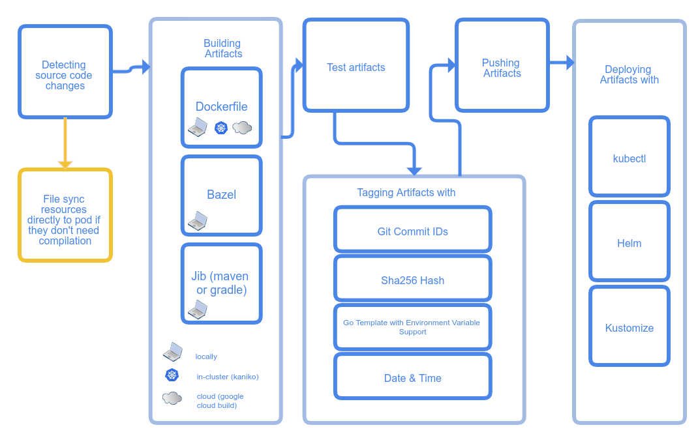

# 通过skaffold快速部署微服务

> 随着技术的不断发展，程序员们熟悉的传统单体应用开发流程，渐渐地无法适应当下微服务化的潮流趋势。同时随着云原生开发的理念不断推广，越来越多的服务运行在不可变的基础设施之上，随之而来的是传统单体应用开发流程与云化程度日益加深服务之间的隔阂越发巨大，开发人员越来越难以容忍重复繁琐且容易出错的低效率开发流程。因此，一款面向开发人员而运维实施人员的持续构建与持续部署工具 `skaffold` 应运而生

## skaffold简介

[skaffold]() 是一款 `Google` 推出的持续构建与持续部署工具，它主要面向开发人员而非运维实施人员，目标是打破本地开发与云化部署之间的隔阂，减轻开发人员的心智负担，帮助开发人员专注于出色地完成日常开发工作，避免开发人员在纷乱繁杂的运维流程中过多消耗宝贵的精力与时间。

### 基本架构



`skaffold` 的工作流按照开发流程的不同阶段，分为4个部分组成：

1. 本地开发(文件同步)
2. 持续构建
3. 持续测试
4. 持续部署

以上四个部分均可以根据实际需求进行定制化修改。

#### 本地开发

`skaffold` 对主流的编程语言以及配套使用的技术栈都有着非常不错的支持，例如 `Go` 、`Java`、`JavaScript` 等

本地开发的核心内容是 `文件同步`，文件同步的监听对象大概可以分为 `源代码` 和 `编译产物` 。

`skaffold` 官方的推荐做法是监听源代码变动，然后自动化把源代码复制到Docker容器中进行编译和构建。

这种做法的问题不少，首先是源代码变动非常频繁，而编译和构建过程往往非常耗时，因此自动触发构建不太合理。

其次，在Docker容器中编译和构建，需要掌握编写 `Multi Stage Dockerfile` 技能，否则构建出来的镜像大小会占据非常大的空间，另外还要消耗本就不宽裕的带宽进行镜像传输。

最后，在Docker容器中编译和构建，要解决环境变量，代理设置、缓存构建中间结果等一系列问题，对新手非常不友好。

因此，个人推荐，在本地开发环节尽量采用手动触发编译构建，通过监听编译产物的方式来触发热更新等流程。

#### 持续构建

因为选择手动触发编译，所以本环节的内容主要讲述如何打包镜像的内容

目前 `skaffold` 官方支持的构建方式有三种：`Docker`、`Jib(maven/gradle)`、`Bazel`

* Docker
* Jib(maven/gradle)
* Bazel

这里以最常见 `Docker` 为例：

```yaml
build:
  local:
    push: false                        # 镜像打包成功后是否推送到远端的镜像仓库
  artifacts:                           # 支持打包多个不同组件的镜像
    - image: datacenter-eureka         # 打包后的镜像名称
      context: "eureka"                # Dockerfile相对路径，就放在eureka目录下
      docker:
        dockerfile: Dockerfile
    - image: datacenter-school         # 打包后的镜像名称
      context: "school"                # Dockerfile相对路径
      docker:
        dockerfile: Dockerfile
    - image: datacenter-teacher        # 打包后的镜像名称
      context: "teacher"               # Dockerfile相对路径
      docker:
        dockerfile: Dockerfile
    - image: datacenter-student        # 打包后的镜像名称
      context: "student"               # Dockerfile相对路径
      docker:
        dockerfile: Dockerfile
```

当运行 `skaffold dev` 时，会按照 `编译 —> 构建 -> 测试 -> 部署` 的标准流程走一遍。
当监听到指定路径下的文件发生变化时，skaffold工具会尝试通过类似于 `kubectl cp` 命令的方式，直接把产生变化后的文件拷贝到运行中的容器内部，避免重新走一遍编译构建/上传镜像的步骤，减少同步代码更改而消耗的时间。

需要特别注意，这种方式对于支持 `代码热更新` 的技术栈非常实用，例如 `Java` 和 `Javascript`，但对于 `Go` 这类不支持 `热更新` 的技术栈来说效果十分有限，因为即便文件同步完成，依然重启主进程才能让修改后的功能生效。

接着说 `Jib(maven/gradle)` ，`Jib` 也是由谷歌开发的一款专门针对 `Java` 生态的 `CI/CD` 工具，跟 `skaffold` 通用 `CI/CD` 不同，同时还有 `VSCode` 和 `IDEA` 插件， 但作者本人并没有用过，所以等以后有机会再展开讲。

至于 `Bazel` 是微软开发的全平台构建工具，主要支持 `C#` 语言，甚至连前端相关 `Javascript` 项目也可以使用，但缺点就是非常笨重，这里也不展开讲。

此外， skaffold 还支持 `Customize` 自定义构建，这个方式的构建更自由可控，比如有些 `WSL` 环境的用户不愿意为了安装 `Docker` 环境而反复折腾，甚至有些企业内部不允许员工在开发电脑安装虚拟机等等，通过自定义构建流程都可以解决，放到文章最后再详细讲解。

#### 持续测试

`skaffold` 官方的测试方案是把代码拷贝到定制化的测试环境容器中执行测试用例，这种方法非常麻烦，测试相关的内容这里就不展开讲。
感兴趣的读者可以查看 [skaffold官方配置文档](https://skaffold.dev/docs/references/yaml/)

#### 持续部署

`skaffold` 官方支持的部署方式有很多种，这里以 `helm` 为例：

```yaml
deploy:
  helm:
    releases:
    - name: datacenter
      chartPath: package
      artifactOverrides:
        image:
          eureka: datacenter-eureka      # 镜像名称要跟前面构建环节的镜像名称保持一致，但不能出现镜像标签
          school: datacenter-school      # 镜像名称要跟前面构建环节的镜像名称保持一致，但不能出现镜像标签
          teacher: datacenter-teacher    # 镜像名称要跟前面构建环节的镜像名称保持一致，但不能出现镜像标签
          student: datacenter-student    # 镜像名称要跟前面构建环节的镜像名称保持一致，但不能出现镜像标签
      imageStrategy:
        helm: {}
```

### 配置参考

完整的配置文件可以参考：[datacenter](https://github.com/zaoying/datacenter/blob/master/skaffold.yaml)

## 上手实践

### 前期准备

* [skaffold](https://github.com/GoogleContainerTools/skaffold/releases/latest)
* [helm](https://github.com/helm/helm/releases/latest)

点击上述两个组件的链接，下载到本地，再讲二进制加入 `PATH` 环境变量，详细安装过程不再赘述。

### 基本开发环境配置

像 `JDK` 、`maven` 或 `Gradle` 这类Java开发必备的工具请自行安装，这里就不展开讲了。

### 初始化helm chart

在一个空白目录下运行 `helm create datacenter` 命令，即可快速创建 `chart` 包，包的目录结构如下所示：

```txt
├── Chart.yaml
├── charts
├── templates
│   ├── NOTES.txt
│   ├── _helpers.tpl
│   ├── deployment.yaml
│   ├── hpa.yaml
│   ├── ingress.yaml
│   ├── service.yaml
│   ├── serviceaccount.yaml
│   └── tests
│       └── test-connection.yaml
└── values.yaml
```
可以根据自身的实际需求，增删修改包的文件内容，例如这里用不到 `hpa.yaml` 、 `serviceaccount.yaml` 和 `tests/*` ，所以都删除了。

然后把 `datacenter` 重命名为 `package` ，然后移动到原本的代码目录下，这是约定成俗的习惯。

### 部署MySQL服务

经典的Web应用往往离不开数据库，而在k8s上运行数据库，则需要提供持久化存储，否则数据库的容器重启后数据就丢失了。

首先，在 `package/templates` 目录下创建 `pv.yaml` 文件，然后写入以下内容：

```yaml
kind: PersistentVolume
apiVersion: v1
metadata:
  name: mysql-pv-volume
  namespace: spring-cloud
  labels:
    type: local
spec:
  storageClassName: manual
  capacity:
    storage: 2Gi
  accessModes:
    - ReadWriteOnce
  hostPath:
    path: "/opt/data/mysql"
```
解释：创建持久化卷 `PersistentVolume` ，简称 `PV`，存储路径就用宿主机目录 `/opt/data/mysql`

然后，在同一个目录下创建 `pvc.yaml` 文件，然后写入以下内容：

```yaml
apiVersion: v1
kind: PersistentVolumeClaim
metadata:
  name: mysql-pv-claim
  namespace: spring-cloud
spec:
  storageClassName: manual
  accessModes:
    - ReadWriteOnce
  resources:
    requests:
      storage: 2Gi
```

解释：创建持久卷使用声明 `PersistentVolumeClaim` ，简称 `PVC`，绑定前面创建的 `PV`。  
`PVC` 的容量是 `2G` ，必须小或等于 `PV` 的容量，否则无法绑定，可以根据实际情况调整容量大小。

> 为了防止卸载过程中意外删除PV卷导致数据丢失的情况，helm不会执行删除 PV 的操作，必须要用户手动执行。
> 因此如果部署过程出现PVC与PV无法绑定而导致无法继续的情况，请手动删除再重新PV以及PVC的方式排除故障


最后，在同一个目录下创建 `statefulset.yaml` 文件，然后写入以下内容：

```yaml
apiVersion: v1
kind: Service
metadata:
  name: mysql                  # 同一个命名空间的其他服务可以通过域名 “mysql” 来访问 MySQL 服务
  namespace: spring-cloud      # 通过命名空间来隔离不同的项目
spec:
  type: ClusterIP
  ports:
  - name: mysql
    protocol: TCP
    port: 3306
    targetPort: 3306
  selector:
    app: mysql                 # 通过定义标签选择器，只转发请求给带有 app: mysql 的Pod
---
apiVersion: apps/v1
kind: StatefulSet
metadata:
  name: mysql
  namespace: spring-cloud
spec:
  selector:
    matchLabels:
      app: mysql
  strategy:
    type: Recreate
  template:
    metadata:
      labels:
        app: mysql
    spec:
      containers:
      - image: mysql:5.6
        name: mysql
        env:
        - name: MYSQL_ROOT_PASSWORD
          value: bocloud@2019    # 密码属于高度敏感机密，建议在生成环境中通过 ServiceAccount 和 ConfigMap 等方式注入
        ports:
        - containerPort: 3306
          name: mysql
        volumeMounts:
        - name: mysql-persistent-storage
          mountPath: /var/lib/mysql
      volumes:
      - name: mysql-persistent-storage
        persistentVolumeClaim:
          claimName: mysql-pv-claim   # 将前面定义的pvc挂载成卷，给容器使用
```
解释：创建 mysql 的 `Service` 和 `StatefulSet`。由于 mysql 是个数据库，属于 `有状态应用` ，所以建议使用 `StatefulSet` 来管理。
另外由于 `k8s` 的机制问题，Pod 重启后IP地址会改变，所以Pod之间的通信不适合直接通过访问 Pod IP 的方式进行，最佳实践是通过创建特定 `Service` ,请求方的 Pod 向特定 Service 发送请求，再由特定 Service 转发请求给被请求方的 Pod。 

### 部署微服务

在 `package/templates` 目录下清空 `deployment.yaml` 文件，然后写入以下内容：

```yaml
apiVersion: apps/v1
kind: Deployment
metadata:
  name: datacenter-dep
  namespace: spring-cloud      # 同一个项目的命名空间一定要相同
  labels:
    app: datacenter            # 自定义标签
spec:
  replicas: 1                       # 副本数量
  selector:
    matchLabels:
      app: datacenter               # 通过统计有多少个带有app: datacenter的Pod来确定副本的数量
  template:
    metadata:
      labels:
        app: datacenter             # 给Pod打上app: datacenter标签，方便统计
    spec:
      containers:
      - name: school
        image: {{.Values.image.school.repository}}:{{.Values.image.school.tag}} # 注入真正的镜像
        imagePullPolicy: IfNotPresent
        env:
        - name: MYSQL_ADDRESS
          value: mysql:3306
        - name: MYSQL_PASSWORD
          value: bocloud@2019           # 密码属于高度敏感机密，不建议在真实环境使用明文密码，这里仅为展示
        ports:
        - containerPort: 8084
      - name: teacher
        image: {{.Values.image.teacher.repository}}:{{.Values.image.teacher.tag}} # 注入真正的镜像
        imagePullPolicy: IfNotPresent
        env:
        - name: MYSQL_ADDRESS
          value: mysql:3306
        - name: MYSQL_PASSWORD
          value: bocloud@2019           # 密码属于高度敏感机密，不建议在真实环境使用明文密码，这里仅为展示
        ports:
        - containerPort: 8082
      - name: student
        image: {{.Values.image.student.repository}}:{{.Values.image.student.tag}} # 注入真正的镜像
        imagePullPolicy: IfNotPresent
        env:
        - name: MYSQL_ADDRESS
          value: mysql:3306
        - name: MYSQL_PASSWORD
          value: bocloud@2019           # 密码属于高度敏感机密，不建议在真实环境使用明文密码，这里仅为展示
        ports:
        - containerPort: 8083

```
解释：根据 `k8s` 的规范要求，应该通过 `Deployment` 来部署 `无状态应用` 。

然后，在同一个目录下清空 `service.yaml` 文件，然后写入以下内容：

```yaml
apiVersion: v1
kind: Service
metadata:
  name: datacenter
  namespace: spring-cloud
spec:
  type: ClusterIP
  selector:
    app: datacenter
  ports:
    - name: school
      protocol: TCP
      port: 8084
      targetPort: 8084
    - name: teacher
      protocol: TCP
      port: 8082
      targetPort: 8082
    - name: student
      protocol: TCP
      port: 8083
      targetPort: 8083

```

解释：创建 `Service` 暴露到集群内部，供集群内部的其他服务调用

最后，修改 `package/values.yaml` 文件，然后写入以下内容：

```yaml
image:
  school:
    repository: datacenter-school
    tag: latest
  teacher:
    repository: datacenter-teacher
    tag: latest
  student:
    repository: datacenter-student
    tag: latest
```
解释：helm 推荐通过 `values.yaml` 文件统一管理 `chart` 模板的变量。
`skaffold` 也是通过修改 `values.yaml` 注入不同的镜像名称，动态更新运行中容器镜像

### 安装配置kubectl和docker

#### 安装kubectl与k8s通信

版本：v1.23.0
* [windows amd64](https://dl.k8s.io/release/v1.23.0/bin/windows/amd64/kubectl.exe)
* [darwin amd64](https://dl.k8s.io/release/v1.23.0/bin/darwin/amd64/kubectl)
* [linux amd64](https://dl.k8s.io/release/v1.23.0/bin/linux/amd64/kubectl)

点击上述链接，下载到本地，再讲二进制加入 `PATH` 环境变量，详细安装过程不再赘述。

 `K8S配置` 一般保存在主节点的 `~/.kube` 目录下，将完整目录复制到本地目录下，打开目录下的 `.kube/config`，可以类似的内容如下：

```yaml
apiVersion: v1
clusters:
- cluster:
    certificate-authority-data: "****"  # 证书颁发机构的证书
    server: https://172.24.86.22:6443   # k8s的apiserver地址
  name: kubernetes                      # k8s集群的名称
contexts:
- context:
    cluster: kubernetes                        # 上下文的k8s集群的名称
    user: kubernetes-admin                     # 上下文的k8s凭证的用户名称
  name: kubernetes-admin@kubernetes
current-context: kubernetes-admin@kubernetes   # 设置当前上下文的所使用的k8s集群
kind: Config
preferences: {}
users:
- name: kubernetes-admin             # k8s凭证的用户名称
  user:
    client-certificate-data: "****"  # 用户证书
    client-key-data: "****"          # 用户密钥

```

然后设置环境变量 `KUBECONFIG` 指向本地的 `./kube/config` 路径，`kubectl` 便可以通过凭证与 `k8s` 的 `APIServer` 通信。

#### 安装 `docker` 用于打包镜像

> 如果你的本地电脑环境存在docker环境，可以跳过docker安装配置环节
##### 安装Docker客户端

点击[这里](https://github.com/docker/cli/releases/latest)，
下载到本地，再讲二进制加入 `PATH` 环境变量，详细安装过程不再赘述。

##### 配置Docker

假设你的WSL环境中存在 `Docker` 环境，又或者远程Linux服务器上存在 `Docker` 环境，
可以通过修改 `Docker` 守护进程的配置，将 `Docker` 进程暴露到内网供其他设备进行使用。

首先，编辑 `/etc/systemd/system/multi-user.target.wants/docker.service` 文件，将 `ExecStart` 行改成以下内容：

```conf
ExecStart=/usr/bin/dockerd --containerd=/run/containerd/containerd.sock
```

重点是去掉 `fd://` ，接着编辑 `/etc/docker/daemon.json` 文件，重点是 `hosts` 加上 `fd://` 和 `tcp://0.0.0.0:10086`，
端口号可以根据实际情况调整

```json
{
  "hosts": [
    "fd://",
    "tcp://0.0.0.0:10086"
  ],
  "registry-mirrors": [
    "https://docker.mirrors.ustc.edu.cn/",
    "https://dockerhub.azk8s.cn/",
    "https://hub-mirror.c.163.com/"
  ],
  "exec-opts": ["native.cgroupdriver=systemd"],
    "log-driver": "json-file",
    "log-opts": {
      "max-size": "100m"
  },
  "storage-driver": "overlay2"
}
```

接口执行以下命令，重启 `docker`

```sh
systemctl daemon-reload
systemctl restart docker
```

最后，在本地设置环境变量 `DOCKER_HOST=<eth0IP>:10086` ，把 `<eth0IP>` 换成远程Linux服务器的真实IP。
在本地命令行界面，执行 `docker info` 命令检查是否设置成功。

```txt
C:\WINDOWS\system32>docker info
Client:
 Context:    default
 Debug Mode: false
 Plugins:
  buildx: Docker Buildx (Docker Inc., v0.7.1)
  compose: Docker Compose (Docker Inc., v2.2.1)
  scan: Docker Scan (Docker Inc., 0.9.0)

Server:
 Containers: 0
  Running: 0
  Paused: 0
  Stopped: 0
 Images: 30
 Server Version: 20.10.12
 Storage Driver: overlay2
  Backing Filesystem: extfs
  Supports d_type: true
  Native Overlay Diff: true
  userxattr: false
 Logging Driver: json-file
 Cgroup Driver: systemd
 Cgroup Version: 1
 Plugins:
  Volume: local
  Network: bridge host ipvlan macvlan null overlay
  Log: awslogs fluentd gcplogs gelf journald json-file local logentries splunk syslog
 Swarm: inactive
 Runtimes: io.containerd.runc.v2 io.containerd.runtime.v1.linux runc
 Default Runtime: runc
 Init Binary: docker-init
 containerd version: 7b11cfaabd73bb80907dd23182b9347b4245eb5d
 runc version: v1.0.2-0-g52b36a2
 init version: de40ad0
 Security Options:
  seccomp
   Profile: default
 Kernel Version: 5.10.74.3-microsoft-standard-WSL2+
 Operating System: Ubuntu 20.04.3 LTS
 OSType: linux
 Architecture: x86_64
 CPUs: 8
 Total Memory: 7.239GiB
 Name: LAPTOP-MAGICBOOKPRO
 ID: EXNQ:FGLE:MROB:C7FG:WJXC:R7YV:HUFB:6A46:4KAW:LG2A:TM3J:SAAB
 Docker Root Dir: /var/lib/docker
 Debug Mode: false
 Registry: https://index.docker.io/v1/
 Labels:
 Experimental: false
 Insecure Registries:
  127.0.0.0/8
 Registry Mirrors:
  https://docker.mirrors.ustc.edu.cn/
  https://dockerhub.azk8s.cn/
  https://hub-mirror.c.163.com/
 Live Restore Enabled: false
```

### 填写skaffold配置并运行

在项目根目录下，创建 `skaffold.yaml` 文件，填写以下内容

```yaml
apiVersion: skaffold/v2beta26	                 # version of the configuration.
kind: Config	                                 # always Config.
metadata:
  name: datacenter
build:
  local:
    push: false
  artifacts:
    - image: datacenter-school         # must match in artifactOverrides
      context: "school"
      docker:
        dockerfile: Dockerfile
    - image: datacenter-teacher        # must match in artifactOverrides
      context: "teacher"
      docker:
        dockerfile: Dockerfile
    - image: datacenter-student        # must match in artifactOverrides
      context: "student"
      docker:
        dockerfile: Dockerfile
deploy:
  helm:
    releases:
    - name: datacenter
      chartPath: package
      artifactOverrides:
        image:
          school: datacenter-school               # no tag present!
          teacher: datacenter-teacher               # no tag present!
          student: datacenter-student               # no tag present!
      imageStrategy:
        helm: {}
```

再执行 `skaffold dev` 命令，如果前面的步骤和配置都正确，应该可以看到以下输出

```txt
C:\Users\huang\Documents\datacenter>skaffold dev
time="2022-02-14T00:13:29+08:00" level=warning msg="failed to detect active kubernetes cluter node platform. Specify the correct build platform in the `skaffold.yaml` file or using the `--platform` flag" subtask=-1 task=DevLoop
Listing files to watch...
 - datacenter-eureka
 - datacenter-school
 - datacenter-teacher
 - datacenter-student
Generating tags...
 - datacenter-eureka -> datacenter-eureka:13577a5
 - datacenter-school -> datacenter-school:13577a5
 - datacenter-teacher -> datacenter-teacher:13577a5
 - datacenter-student -> datacenter-student:13577a5
Checking cache...
 - datacenter-eureka: Found. Tagging
 - datacenter-school: Found. Tagging
 - datacenter-teacher: Found. Tagging
 - datacenter-student: Found. Tagging
Tags used in deployment:
 - datacenter-eureka -> datacenter-eureka:769afdbaaf2a35acada2a56cf1d1cccbc8a8ab8196396a8ff9e2803cf6a49490
 - datacenter-school -> datacenter-school:b89167e724932d41e40945a39ff04d84e419345957c4c0a022e7c4694153b609
 - datacenter-teacher -> datacenter-teacher:9d013f9295b7bd3e75b68b2d8a9df434a77cbc9514df1ae36a967b6841c4328f
 - datacenter-student -> datacenter-student:3f5267479ce35cec929485edce5f1dfc2cb1017136bbc90f2a0de5cd4f48f808
Starting deploy...
```

### [可选]使用[Buildah](https://buildah.io/)代替Docker

对于 `WSL1` 或者 嫌弃在 `WSL2` 安装 `docker` 环境太麻烦的 `windows` 用户，以及不想在本地安装 `docker` 的 `Mac` 用户，
可以尝试安装 `redhat` 开源的 `buildah` 

按照[官方教程](https://github.com/containers/buildah/blob/main/install.md)自行安装即可

 `buildah` 基于 `fork` 模型，不需要 `daemon` 守护进程，因此不依赖于 `systemd` ，不需要root权限即可运行。
 安装完后即可使用，不需要额外的配置。但 `skaffold` 尚未提供 `buildah` 官方支持，因此需要自定义构建脚本。

 ```yaml
 # 待补充
 ```

### [可选]代码热更新

代码热更新在日常的开发过程非常实用，可以加快特性开发与功能验证的效率。

skaffold 实现代码热更新的关键步骤是在构建环节中，跳过 `mvn package` 打包环节，
直接将编译的中间产物，例如 `.class` 字节码文件同步到运行中的容器中，在不重启容器的前提下实现代码热更新。

理论上来说，skaffold 的代码热更新功能同时适用于 `Java` 和 `Javascript` 等技术栈。

代码热更新的重点在于如何编写 skaffold 的自定义构建 `Customized` 环节代码：

```yaml
# 待补充
```

### 总结

本次演示所使用的微服务项目是很多年前笔者为了学习 `Spring Cloud` 而编写的 `Demo` 。
时隔多年 `Spring Cloud` 已经不再推荐 `Eureka` 作为服务发现与注册中心。
同时 `k8s` 本身也支持将 `CoreDNS` 作为服务发现/注册的组件使用。
所以读者不必纠结 `Demo` 代码中的错误，因为本文的重点是 `skaffold` 的配置与使用。