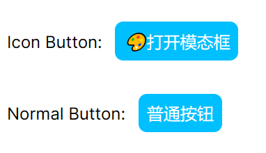
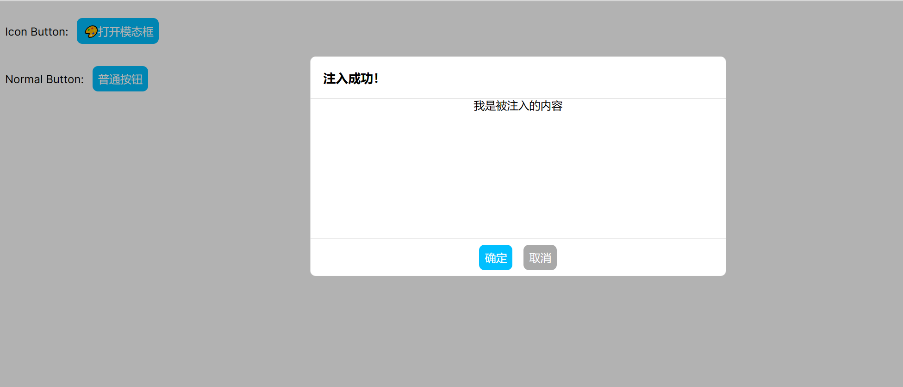

useIoC——仅一百多行代码实现前端的依赖注入
========================

前言
--

> 对于一个从事7年Java的开发者来说，Spring依赖注入已经变成日常开发工作的一部分，尤其是最近三年切换Go技术栈更是怀念，尽管有些老员工总是忽悠我Go不是面向对象的语言，所以不需要依赖注入。

### 示例

为什么说他们在忽悠？以下面代码 `demo_controller.go` 为例：

```go
func NewDemoController(demoService DemoService) *DemoController {
  return &DemoController{
    demoService: demoService
  }
}

struct DemoController {
  demoService DemoService
}

func (d *DemoController) Hello() Response {
  id := d.Ctx.getString(":id")
  if person, err := d.demoService.GetPerson(id); err != nil {
    return Reponse.Error(404, "can not this person")
  }
  return Response.Success(fmt.Sprintf("hello, %s", person.name))
}
```

然后编写单元测试用例 `demo_controller_test.go`

```go
struct FakeDemoService {
  person: *Person
  err: error
}

func (f *FakeDemoService) GetPerson(id: string) (*Person, error) {
  return f.person, f.err
}

func Test_demoController_Hello_Success(t *testing.T) {
  fakeDemoService := &FakeDemoService{
    person: &Person{Name: "Joe"},
    err: nil
  }
  controller := NewDemoController(fakeDemoService)
  resp := controller.Hello("1234")
  assert.Equalf(t, resp.code, 200, "status code should be 200")
  assert.Equalf(t, resp.msg, "hello, ", "status code should be 200")
}

func Test_demoController_Hello_Failed(t *testing.T) {
  fakeDemoService := &FakeDemoService{
    person: nil,
    err: fmt.Errorf("Not Found")
  }
  controller := NewDemoController(fakeDemoService)
  resp := controller.Hello("1234")
  assert.Equalf(t, resp.code, 404, "status code should be 404")
}
```

以上的测试用例，充分说明依赖注入的重要性，尤其是在追求高代码测试覆盖率的前提下。

尽管是手动依赖注入，但远比给测试代码 **打桩** 优雅多了，所以那些嘲笑 Java 开发者离开 Spring 就无法写出优雅代码的人可以闭嘴了！

### 例外

然而有些场景使用全局变量或有副作用的函数，就必须对有副作用的函数使用打桩工具，才能保证测试用例可重复执行。如下：

```go
// 如果file文件刚好存在就不会返回错误，但无法保证每次执行的结果都一致
func DeleteFile(file: string) error {
  return os.Rm(file)
}
```

由此可见，那些宣称 **只有面向对象才需要依赖注入** 的人都是在装疯卖傻，严格来说 `打桩` 也是一种非常不优雅的依赖注入。

### 总结

在我看来，面向对象 `OOP` 编程思想最大的贡献是把 `全局变量` 这个万恶之源给钉死在耻辱柱上，这个恰恰是许多初学者在接触 `面向过程` 最容易染上的陋习。

> 许多宣称面向过程不需要依赖注入的人，恰恰是使用全局变量代替依赖注入。

`Spring` 则是把这个陋习给公开化，尽管 Spring 的单例模式也有全局变量的意思，但在 `ThreadLocal` 的支持下，也部分解决多线程并发环境单例模式可能会存在的线程安全风险，最典型的例子就是Java八股文经常会问到的**日期格式化工具** 要怎么解决线程安全问题

然而受到面向对象的局限，Spring虽然能解决全局变量的问题，但依然无法做到尽善尽美，因为面向对象的思想忽略了非常关键且致命的 `Side Effect` 副作用。

React 代码复用之路
------------

当React 推出 `Hooks` 时，社区的评价可以分为两类：一是 `Mixin` 和 `HOC` 的替代品，二是 `Monad` 的替代品。

先说 `Mixin` 和 `HOC` 的替代品，其实当我第一眼看到 `Mixin` 的时候，我的第一反应是 **面向对象** 和 **依赖注入** 都诞生这么多年，前端搞代码复用为啥不借鉴一下？

### 例子

假设要你写一个计算两点之间距离的函数，以下是面向过程的写法：

```typescript
// 求实数轴上两点之间的距离
function distance(p1: number, p2: number): number {
    return Math.abs(p1 - p2)
}
```

然后，需求又变了，要求增加对平面二维、立体三维的支持：

```typescript
// 求二维平面上两点之间的距离
function distance2(x1: number, y1: number, x2: number, y2: number): number {
    return Math.sqrt(Math.pow(x1 - x2, 2) + Math.pow(y1 - y2, 2))
}
// 求三维空间中两点之间的距离
function distance3(x1: number, y1: number, z1: number, x2: number, y2: number, z2: number): number {
    return Math.sqrt(Math.pow(x1 - x2, 2) + Math.pow(y1 - y2, 2) + Math.pow(z1 - z2, 2))
}
```

但说实话，这样写法看起来实在太蠢了，于是写了个通用的计算距离的函数：

```typescript
// 通用函数
// 缺点：不同的类型不能比较，无法在编译期报错，只能在运行期抛出异常
function genericDistance(p1: number[], p2: number[]): number 
    if (p1.length == 0 || p2.length == 0) {
        throw Error("length must greater then zero.")
    }
    if (p1.length != p2.length) {
        throw Error("p1's length must equals p2's length.")
    }

    let sum = 0;
    for (let i = 0; i < p1.length; i++) {
        sum += Math.pow(p1[i] - p1[i], 2)
    }
    return Math.sqrt(sum)
    }
```

这样一来，问题是解决了，但当 `p1` 和 `p2` 的长度不同时编译器应该报错，而不是到运行时才抛出异常。

### 面向对象

既然 **面向过程** 无计可施，那么我们可以用 **面向对象** 来试试

```typescript
// 定义接口
interface Distance {
    distance(p: P): number
}
```
```typescript
// 二维平面点
class Point implements Distance {
    x: number
    y: number
    constructor(x: number, y: number) {
        this.x = x;
        this.y = y;
    }
    distance(p: Point): number {
        return Math.sqrt(
            Math.pow(this.x - p.x, 2) 
            + Math.pow(this.y- p.y, 2)
        )
    }
}
```
```typescript
// 三维立体点
class Cubic implements Distance {
    x: number
    y: number
    z: number
    constructor(x: number, y: number, z: number) {
        this.x = x;
        this.y = y;
        this.z = z;
    }
    distance(c: Cubic): number {
        return Math.sqrt(
            Math.pow(this.x - c.x, 2) 
            + Math.pow(this.y- c.y, 2) 
            + Math.pow(this.z - c.z, 2)
        )
    }
}
```

看起来很简单，但却很好地解决 一维、二维 和 三维 的点明明不能直接比较，却还得抛出异常的问题。

### 代码复用

然后还可以轻松实现代码复用，假如说需求更改了，要求你把计算距离的算法换成 “曼哈顿距离”：

```typescript
// 平面曼哈顿距离
class ManhattanPoint extends Point implements Distance{
    distance(mp: ManhattanPoint): number {
        return Math.abs(this.x - mp.x) + Math.abs(this.y- mp.y)
    }
}
// 立体曼哈顿距离
class ManhattanCubic extends Cubic implements Distance{
    distance(mc: ManhattanCubic): number {
        return Math.abs(this.x - mc.x) + Math.abs(this.y- mc.y) + Math.abs(this.z - mc.z)
    }
}
```

### Class Component

如果到了这里，你还是有疑问，毕竟不能直接套用到真实的前端开发中，那么请看以下代码：

假设我们要写一个 `Button` 组件，然后复用它的代码，派生出一个 `IconButton`

```typescript
import { Component, ReactNode } from "react";

export class Button extends Component {
    onClick?: () => void
    children?: ReactNode
    constructor(onClick?: () => void, children?: ReactNode) {
        super({});
        this.onClick = onClick ?? () => {};
        this.children = children;
    }
    render() {
        return {this.children};
    }
}

export class IconButton extends Button {
    constructor(icon: string, onClick?: () => void, children?: ReactNode) {
        super(onClick, children);
        this.children = <><i>icon</>{this.children}</>;
    }
}
```

这样的写法可比 `Mixin` 优雅多了，和 `HOC` 写法差不多，但 `HOC` 的缺点是嵌套层数太多，面向对象的写法也有类似的问题，但是别忘了 **面向对象** 还有一招 **依赖注入** 。

### 困难

对 Spring 熟悉的人，很容易想到通过依赖注入不同的 `children` 就得到不同的 `Button` 实例，注入带 `Icon` 的 `children` 就可以得到 `IconButton` ，比 `HOC` 还优雅！

说起来容易但做起来却非常困难，且不说 `TypeScript` 的 `Decoration` 获取具体的类型非常困难，而且 Spring 要求构造函数的参数必须为空，就和现有的前端代码产生非常大的冲突；

更令人难受的是 React 项目默认开启 `use strict;` ， `this` 全变成 `undefined` ，class component都没办法写，所以照搬 Spring 肯定是不行的。

代数效应
----

> 山重水复疑无路，柳暗花明又一村

React 官方介绍 Hooks 还提到 `Algebraic Effects` 代数效应，在查询相关资料的过程，有人评价：简单理解，代数效应就是依赖注入。

我心中暗喜，既然React 官方还是回到依赖注入的康庄大道，那我背 Spring 八股文就有用武之地了。

### 通过Hook实现依赖注入

#### 约束

首先，必须说清 Spring 依赖注入已知的限制：

1.  被注入对象的构造函数参数必须为空
2.  一般情况，一个application只有一个context

为了解决以上问题，因此对Hook实现依赖注入进行以下限制：

1.  被注入IoC容器的不再是实例，而是构造函数，构造函数的参数只有一个，必须是Object类型
2.  每个组件都会绑定一个独立的context，在组件树中父级组件可以影响向子组件注入的依赖

第一点的限制，完全兼容 React 官方的 FunctionComponent 约束，所以铁子们不能担心兼容性问题；

第二点的限制，更确切的说法是增强，目的为了解决组件套娃的情况下，可以轻松向层层套娃的子组件注入依赖，同时只对直系组件有影响，不会影响到旁系的组件。

#### 具体实现

以下是 `useIoC` 的具体实现：

```typescript
import { v4 as uuidv4 } from 'uuid';
// 组件的构造函数定义
export type Func = (args: I) => O
// IoC容器的接口定义
export interface Container {
    /**
     * 将组件注册到IoC容器中
     * @param key 组件ID
     * @param val 组件构造函数
     */
    register(key: string, val: any): void
    /**
     * 从IoC容器获取组件的构造函数
     * @param key 组件ID
     */
    get(key: string): T
}
// IoC容器的具体实现
function IoCContainer(): Container {
    let storage = new Map()
    return {
        register: function(key, val) {
            storage.set(key, val)
        },
        get: function(key: string): T {
            return storage.get(key)
        }
    }
}
// IoC容器的上下文接口定义
export interface Context {
    /**
     * 定义组件：将组件注册到IoC容器，如果参数subType不为空就组件的原始构造函数替换为subType
     * @param component 组件：原型链必须存在componentId
     * @param subType 组件构造函数的子类型，可以为空
     */
    define(component: Func, subType?: Func): Func
    /**
     * 从IoC容器中，根据componentId获取原始构造函数
     * @param component 组件：原型链必须存在componentId
     * @param props 父组件传递过来的IoC容器上下文
     */
    inject(component: Func, props?: any): Func
}
/**
 * 包装组件的构造函数
 * @param originFunction 组件的原生构造函数
 * @param container 组件的IoC容器上下文
 * @returns 返回包装函数
 */
function wrap(originFunction: Func, container: Container): Func {
    const wrapped = function (props: I) {
        // 将当前组件的IoC容器上下文加入到组件参数中，传递给子组件
        const newProps = {ioCContainer: container, ...props}
        return originFunction(newProps)
    }
    // 由于typescript编译到js过程中会丢失类型信息，这里使用唯一的uuid代替原本的类型信息
    wrapped.prototype.componentId = uuidv4() 
    // 原型链增加originFunction字段指向原始构造函数
    wrapped.prototype.originFunction = originFunction
    return wrapped
}
// IoC容器上下文的具体实现
function IoCContext(): Context {
    const container = IoCContainer()
    return {
        define: function(component: Func, subType?: Func): Func {
            const originFunction = subType ?? component
            if (subType) {
                // 如果参数subType不为空就将IoC容器中的componentId对应的原始构造函数替换为subType
                const componentId = component.prototype.componentId
                componentId && container.register(componentId, originFunction)
            }
            return wrap(originFunction, container)
        },
        inject: function(component: Func, props?: any): Func {
            const componentId = component.prototype.componentId
            if (componentId) {
                // 如果父级组件传递过来的参数中包含了IoC容器，就直接从父级IoC容器中获取组件的构造函数
                if (props && props.ioCContainer) {
                    const iocContainer: Container = props.ioCContainer
                    const originFunction: Func = iocContainer.get(componentId)
                    if (originFunction) {
                        return wrap(originFunction, container)
                    }
                }
                // 如果父级IoC容器为空，或者不存在componentId对应的构造函数，则尝试在当前的IoC容器中获取
                let originFunction: Func = container.get(componentId)
                if (!originFunction) {
                    // 如果父级或当前IoC容器找不到componentId对应的构造函数，则直接返回原型链上的originFunction
                    originFunction = component.prototype.originFunction ?? component
                }
                return wrap(originFunction, container)
            }
            // 如果componentId为空，就直接返回component
            return component
        }
    }
}
// 每次调用都会产生一个新的IoCContext实例，
// 通过define函数将组件注册到IoCContext
// 然后再通过inject函数将注册的组件注入到其他组件中
export const useIoC = function(): Context {
    return IoCContext()
}
```

以上的代码实现，只引用一个第三方依赖：uuid，之所以不用React.useId()，目的是为了减少迁移到 Vue 等其他框架的成本，理论上只需要修改 `Func` 的定义即可。

#### 简单例子

先定义一个 `Button` 组件:

```typescript
import { FC, ReactNode } from "react"
import {useIoC} from "Com/app/hooks/ioc"

const {define, inject} = useIoC()

export const ButtonChildren: FC<{label: string}> = define((props: {label: string})  => {
    return (<span>{props.label}</span>)
})

type ButtonType = "primary" | "second" | "grey"

type ButtonProps = {
    onClick?: () => void
    type?: ButtonType
    children?: ReactNode
}

export const Button: FC<ButtonProps> = define(function(props) {
    const child = inject(ButtonChildren, props);
    return (
        <a className={`${props.type ?? "primary"} button`} onClick={(e: any) => props.onClick && props.onClick()}>
            {props.children || child({label: "Click Me!"})}
        </a>
    );
})
```

然后定义一个 `IconButton` ，注入带有 `Icon` 的 `children` ，如下所示：

```typescript
import { useIoC } from "Com/app/hooks/ioc"
import { Button, ButtonChildren } from "./button"
import { FC } from "react"

const {define, inject} = useIoC()

export const IconButtonChild = define(ButtonChildren, () => <span><i>🎨</i>图标按钮</span>)

export const IconButton: FC<{onClick?: () => void}> = define((props) => {
    const button = inject(Button, props)
    return <>{button(props)}</>
})
```

最后，编写一个页面：

```typescript
"use client";

import { Button } from "./components/basic/button";
import { IconButton } from "./components/basic/iconButton";

export default function Home() {
  return (
    <div>
      <p>Icon Button: <IconButton></IconButton></p>
      <p>Normal Button: <Button>普通按钮</Button></p>
    </div>
  );
}
```

显示效果：



即便 `IconButton` 组件内部也引用 `Button` 组件，但由于 `普通按钮` 和 `打开模态框` 在组件树上是旁系不是直系，所以没有相互影响，这就是和传统的 Spring 依赖注入最大的不同之一！

#### 复杂例子

如果到了这里，你还是觉得通过 `useIoC` 依赖注入子组件，并没有比通过 `children` 传递子组件更优雅，那就来个更复杂的例子，比如实现一个 `Modal` 组件：

```typescript
import { useIoC } from "Com/app/hooks/ioc";
import { FC } from "react";
import { Button } from "../basic/button";

const {define, inject} = useIoC()

export const Header: FC<{title: string}> = define((props) => {
    return (
        <h3>{props.title}</h3>
    )
})

export const Body: FC = define(() => {
    return (<></>)
})

export const Footer: FC<{confirm: string, cancel: string}> = define((props) => {
    return (<div className="two buttons">
            <Button type="primary">{props.confirm}</Button>
            <Button type="grey">{props.cancel}</Button>
        </div>)
})

export const Modal: FC = define((props) => {
    const header = inject(Header, props)
    const body = inject(Body, props)
    const footer = inject(Footer, props)
    return <div className="dimmer">
        <div className="modal">
            <div className="header">{header({title: ""})}</div>
            <div className="body">{body({})}</div>
            <div className="center footer">{footer({confirm: "Confirm", cancel: "Cancel"})}</div>
        </div>
    </div>
})
```

```typescript
"use client";

import { FC, useState } from "react";
import { Button } from "./components/basic/button";
import { IconButton } from "./components/basic/iconButton";
import { Body, Footer, Header, Modal } from "./components/modal/modal";
import { useIoC } from "./hooks/ioc";

const {define, inject} = useIoC()

define(Header, () => <p className="title">注入成功！</p>)

define(Body, () => <div>我是被注入的内容</div>)

const CustomFooter: FC<{onConfirm: () => void, onCancel: () => void}> = (props) => {
    return (<div className="two buttons">
        <a className="primary button" onClick={props.onConfirm}>确定</a>
        <a className="grey button" onClick={props.onCancel}>取消</a>
    </div>);
  }

export default function Home() {
  const [visible, toggleVisible] = useState(false)
  const [open, close] = [() => toggleVisible(true), ()=>toggleVisible(false), ]
  define(Footer, () => <CustomFooter onConfirm={close} onCancel={close}></CustomFooter>)
  const modal = inject(Modal)

  return (
    <div>
      <p>Icon Button: <IconButton onClick={open}></IconButton></p>
      <p>Normal Button: <Button>普通按钮</Button></p>
      { visible && modal({}) }
    </div>
  );
}
```
通过依赖注入，可以把大量无关的内容放到方法体以外，做到 `关注点分离` ，代码可读性答大幅提升。

显示效果：



像 `Modal` 和 `Tab` 等组件往往需要多个children，这时候React是无能为力的，即便像 `Vue` 、`Qwik` 等框架选择 `Web Component` 规范的 `Named Slot` 勉强解决上述问题，但 `Named Slot` 还存在 **不支持类型检查** 和 **个数有限** 两个已知问题。

以 `Tab` 为例，除了 `TabHead` 一个 `Named Slot` 以外，还有无限个的 `TabContent` Slot，再说如果要实现 `TabContent` 内部一个按钮被点击后关闭当前Tab，用Slot实现起来非常麻烦，跟优雅完全不沾边。

#### 分离视图和逻辑控制

在写 `useIoC` 之前，我用过不少开源的第三方封装UI库，比如 `Element UI` 、`Ant Design` 和 `Materi UI` ，它们提供的组件使用起来都不顺手。

下面就用 `Notification` 组件，来展示一下理想中的UI库组件：

```typescript
import { useIoC } from "Com/app/hooks/ioc";
import { FC, ReactNode, useEffect, useState } from "react";

const {define, inject} = useIoC()

export interface Notifier {
    info(msg: string, timeout?: number): void
    warn(msg: string, timeout?: number): void
    error(msg: string, timeout?: number): void
}

export type MsgType = "info" | "warn" | "error";
export type Msg = {
    type: MsgType,
    text: string
    expiredAt: number
}

function newMsg(type: MsgType, msg: string, timeout = 1000): Msg {
    const now = new Date().getTime()
    return {type: type, text: msg, expiredAt: now + timeout}
}

export const Notification: FC<{msgs: Msg[], remove: (id: number) => void}> = define((props) => {
    return <ul className="notification">
        {
            props.msgs.map(msg => (
                <li key={msg.expiredAt} className={`${msg.type} item`}>
                    <span>{msg.text}</span>
                    <a className="icon" onClick={() => props.remove(msg.expiredAt)}>x</a>
                </li>
            ))
        }
    </ul>
})

export const useNotification: (props?: any) => [ReactNode, Notifier] = (props: any) => {
    const notification = inject(Notification, props)
    const [msgs, list] = useState(new Array<Msg>())
    useEffect(() => {
        const interval =setInterval(() => {
            const now = new Date().getTime()
            list(old => old.filter(msg => msg.expiredAt > now))
        }, 1000)
        return () => clearInterval(interval)
    }, [])
    
    const remove = function(id: number) {
        list(old => old.filter(msg => msg.expiredAt != id))
    }

    const notifier: Notifier = {
        info: function(msg: string, timeout = 5000) {
            list((old)=> [...old, newMsg("info", msg, timeout)])
        },
        warn: function(msg: string, timeout = 5000) {
            list((old)=> [...old, newMsg("warn", msg, timeout)])
        },
        error: function(msg: string, timeout = 5000) {
            list((old)=> [...old, newMsg("error", msg, timeout)])
        }
    }
    return [notification({msgs: msgs, remove: remove}), notifier]
}
```

使用：

```typescript
"use client";

import { Button } from "./components/basic/button";
import { useNotification } from "./components/notification";

export default function Home() {
  const [notification, notifier] = useNotification()
  return (
      <Button onClick={() => notifier.info("info")}>通知</Button>
      <Button onClick={() => notifier.warn("warn")}>警告</Button>
      <Button onClick={() => notifier.error("error")}>错误</Button>
      {notification}
  );
}
```

这里，我把视图 `notification` 和 逻辑控制 `notifier` 分开，真正做到 `高内聚、低耦合` 。

我知道前端常见的做法是使用 `zustand` 这类状态管理框架，通过 `dispatchEvent` 方式来实现，但对于我来说，多少有点本末倒置了。

同样的，之前的 `Modal` 也应该有个 `useModal` 的hook：

```typescript
"use client";

import { Button } from "./components/basic/button";
import { useModal } from "./components/modal";

export default function Home() {
  const [dimmer, modal] = useModal()
  modal.onConfirm(() => console.log("确定"))
  modal.onCancel(() => console.log("取消"))
  return (<div>
    <Button onClick={()=>modal.open()}>打开</Button>
    {dimmer}
  </div>);
}
```

除此之外，还应该有 `useTab` 、 `useTable` 、`useMenu` 等hook，复杂组件应该把视图和逻辑控制分开，而不是通过 `visible && modal({})` 这样方式进行控制。 

## 总结

之所以写这篇文章，主要原因是之前和别人吹牛，说要把设计模式带到前端，网友都嘲笑我 *talk is cheap, show me the code* 。

尽管我在公司的代码已经能体现我的思路，但保密协议限制我不能把它放到网上给大家看，而且为了写出的代码和文章容易看懂，我经常需要强迫自己进入 *沙雕兼容* 模式，否则在别人眼中，我就成了孔乙己。